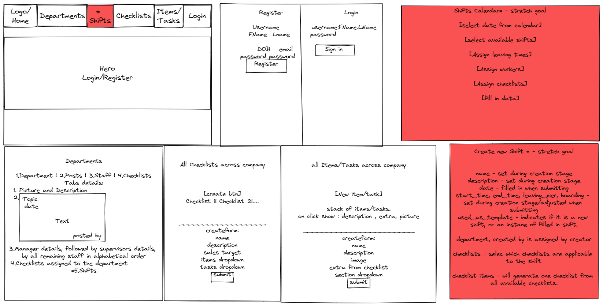

#  GA London SEI Project-4-CompanyPlanner

## TABLE OF CONTENTS

- [Overview](#overview)
  - [Brief](#brief)
  - [Technologies Used](#technologies)
  - [Installation](#installation)
- [Development](#development)
  - [Planning](#planning)
  - [Login / Register](#login-register)
  - [Departments](#departments)
    - [Department](#department)
    - [Posts](#posts)
    - [Staff](#staff)
    - [Checklists](#checklists)
  - [Items](#items)
  - [Tasks](#tasks)
  - [Checklists](#checklists)
  - [Styling](#styling)
- [Difficulties and Wins](#difficulties-wins)
  - [Known Bugs](#bugs)
  - [Challenges and Wins](#challenges-wins)
- [Future Improvements](#future-improvements)
- [Key Learnings](#key-learnings)

## <a name='overview'>Overview</a>

**To view deployed project please click [here](https://companyplanner.netlify.app/).**

The last project at General Assembly's (GA) Software Engineering Immersive (SEI-Flex) bootcamp was to build a full-stack application with Python Django REST framework for the back-end and ReactJS for the front-end.

We had an option to go the solo route, or do it as a group. I wanted to test out my skills by making a full-stack solo CMS (Content Management System)-ish project.

My initial thoughts for the project were also to make an e-commerce site or social media clone, but I decided to make something more unique rather than just another clone for coding bootcamp.

I decided to make a project aimed to solve the paper wastage at my current employer. At the moment most of the documents are being filled-in in a paper format and are being transferred to the computer by the administrator.

I was unable to implement all features that I wanted due to time constraints of doing this project while working full-time at my existing employment, which was entering the peak season at the point of making this project.

However, I am happy that I was able to go above the initial MVP, learned to work with Material UI and gained the foundations to work with the Python Django REST framework to build a quite complex API compared to what has been thought during the course.

### <a name='brief'>Brief</a>

- Choose to go Solo or work in a group.
- Build a full-stack application by making your own backend and your own frontend.
- Use Python Django API using Django REST framework to serve data from the Postgres database.
- Consume your API with a front-end built with React.
- Make a complete product using multiple relationships and CRUD functionality for some models.
- Deploy the project online.

### <a name='technologies-used'>Technologies</a>

Backend: Python, Django, Django REST framework, Postgres, DjangoRESTFramework-simpleJWT, poetry.

Frontend: React, ReactDOM, date-fns, axios, MaterialUI.

Development tools: VS Code, NPM, Insomnia/Postman, Git, Heroku, Netlify.

### <a name='installation'>Installation</a>

- Clone the repo
- Install all frontend packages (from package.json) by running `npm install`
- Start the server with `npm run start`

## <a name='development'>Development</a>

### <a name='planning'>Planning</a>

**Backend planning can be seen [here](https://github.com/rodages/Project4-CompanyPlanner-API).**


The first day was spent planning the structure of the API. Once it got signed off by the lead instructor - I started building the backend API with Python Django REST Framework. I spent the first week working on relationships and testing the API before moving to the front end.


The second week was spent on building the frontend and fixing the minor bugs that I did not plan for when building the backend API.

The app was supposed to have 6 main aspects - `landing page`, `departments`, `shifts`, `checklists`, `items/tasks` and `login/register`. 

The flow of implementing the frontend was scheduled as:
`navbar`->`register/login`->`departments`->`items/tasks`->`checklists`->`shifts`->`validations`(stretch goal - I was able to do it in the third project, hence was more focused on achieving other goals).

The more detailed breakdown of each component and planning for it is explained below:

### <a name='login-register'>Login / Register</a>


- The Registration component has the `Username` field set to inactive - it takes values from `First Name` and `Last Name` to create a username consisting of both values lowercase i.e. `jane.doe` .

```
 <LocalizationProvider dateAdapter={AdapterDateFns} >
                    <DatePicker
                    mask="____/__/__"
                    openTo="year"
                    views={['year', 'month', 'day']}
                    label="Date of Birth"
                    inputFormat="yyyy/MM/dd"
                    value={values.DOB}
                    onChange={handleDateChange}
                    renderInput={(params) => <TextField {...params} />}
                    />
                </LocalizationProvider>
```

- `Date of Birth` field uses a date picker provided by MUI for better customer experience compared to typing it in as prompted.

Mask and inputFormat had to be provided to the component to correctly set up the order of year, month and day.

```
<InputLabel htmlFor="password">Password</InputLabel>
          <OutlinedInput
            id="password"
            type={values.showPassword ? 'text' : 'password'}
            value={values.password}
            onChange={handleChange('password')}
            endAdornment={
              <InputAdornment position="end">
                <IconButton
                  aria-label="toggle password visibility"
                  onClick={handleClickShowPassword}
                  onMouseDown={handleMouseDownPassword}
                  edge="end"
                >
                  {values.showPassword ? <VisibilityOff /> : <Visibility />}
                </IconButton>
              </InputAdornment>
            }
            label="Password"
          />
```

- MUI comes with password reveal functionality. It takes `showPassword` state to toggle type input between text/password and displaying VisibilityOff/Visibility icon components.

- Once the user successfully registers - the website redirects to the `Login` route.

- Successful login will trigger the following state updates at the `App` component.

```
                    setAccessToken(res.data.access);
                    setRefreshToken(res.data.refresh);
                    setLoggedIn(true)
```

To get user details - userID was used to make a request to the `users' list view` to get the username and role.

```
                    setUser({...res.data})
```

followed by navigating the user to `/departments`.

### <a name='departments'>Departments</a>


The departments route provides a list of all available departments within the company. By clicking on the selected department will give more detailed information with the following tabs: `department`, `posts`, `staff`, `checklists` further explained below.

#### <a name='department'>Department</a>

Acts as an initial option in the detailed breakdown of department information. It provides the same information as the department card from the stack of all departments.

#### <a name='posts'>Posts</a>

Displays all posts/announcements related to the department.

#### <a name='staff'>Staff</a>

Lists all staff related to the department.
The list is alphabetical, but the main aspect of sorting the staff is roles. The order for listing staff is `directors` -> `managers` -> `supervisors` -> `all other staff`.

#### <a name='checklists'>Checklists</a>

The checklists tab shows all active checklists that have been assigned to the department.

### <a name='styling'>Styling</a>

Material UI was used to style react components, mui-x-date-pickers was used for the calendar and would have been used for the `shifts` component as a stretch goal.

It was my first time working with this CSS library, but I really enjoyed working with it and found it to be a great fit for the project. Initial idea was to use the `transfer list` component from the MUI library for creating checklists, but due to time constraints `autocomplete` was chosen instead as it was easier to implement.

As it was my first time working with the framework some places have lots of inline styling - this could be improved by creating an external styling file.

## <a name='difficulties-wins'>Difficulties and Wins</a>

### <a name='bugs'>Known Bugs</a>

- Due to time constraints I have not included form validations and error handling for form inputs. Due to this at the current state of the project - the user would not have the best experience when trying to register an account with an already existing username, or entering invalid login credentials.

- All site navigation including posting currently is available to everyone, but on the API side - only registered users can create posts/items/tasks/checklists. If anyone tries to do it without logging in - they will crash the server.

### <a name='challenges-wins'>Challenges and Wins</a>

- Using the `useLocalStorage` hook from the internet helped me to quickly set up tokens in the local storage compared to the third project where I had to tackle the problem myself from scratch.

\*newItemOrTask component tackles upload for both paths depending on which route has been chosen. It takes parameters from the URL using the `useParams() hook and uses the keyword to render the correct form.

```
if(e.target.id=='extra_from_checklist_amount' && e.target.value<0){
            setFormData({...formData, 'extra_from_checklist_amount':0})
        }
```

One form parameter should never go below 0 - to tackle it the above validation was used to reset the data to 0.

- `Autocomplete` component saved lots of time when making a checklist builder compared to the third project, where similar functionality was done by writing component functionality from scratch.

```
      onChange={(_,selectedOptions)=>{
        setSelectedArr(selectedOptions)
      }}
```

However, the important note was passing an empty object as the first argument to the function - it returns an HTML node rather than selected options. This caused bugs until an actual solution has been found.

- Staff table sorting by role and alphabetical order.

```
const directors = workers.filter(worker=>worker.role=='Director').sort((current,next)=>current.username.localeCompare(next.username))
    const managers = workers.filter(worker=>worker.role=='Manager').sort((current,next)=>current.username.localeCompare(next.username))
    const supervisors = workers.filter(worker=>worker.role=='Supervisor').sort((current,next)=>current.username.localeCompare(next.username))
    const staff = workers.filter(worker=>worker.role=='Regular Staff').sort((current,next)=>current.username.localeCompare(next.username))
    const WorkersSortedByRoleAndUsername = [...directors,...managers,...supervisors,...staff]
```

The component could have been DRY'ied up by making a separate sorting function and passed to each iteration, rather than repeating the same line and changing the variable name.

## <a name='future-improvements'>Future improvements</a>

- If I would have had more time - my main priority would have been to place validations and permission for posting to prevent the API from crashing if an unregistered user tries to post Item/ Task/ Checklist.

- Second most important aspect would be to implement `Shifts` functionality. I have managed to make it work on the API side and was really looking forward to making it a capstone of the project by building the frontend for it too.

- Seeding some meaningful data. At the moment all data online is from testing the routes and components.

- Inserting error validators to forms to provide better user experience.

- At the moment CRUD functionality exists on the backend but is not implemented on the front end. The key idea was that directors would be able to edit all content, managers could edit/delete their department scope, supervisors would be able to edit their own created content, while regular staff would only be able to view provided content/ tick off assigned tasks.

- I have worked on creating/editing posts/comments/profiles during the Third group project, hence due to time constraints I did not develop these functionalities that much - spending more time is essential to avoid adding info via Postman/Django admin panel.

- DRYing up the styling code by creating specific classes. At the moment there is lots of repetition going from one component to the other one.

## <a name='key-learnings'>Key Learnings</a>

- I wanted to build a flexible CMS system while having my existing employment as a primary customer. My existing employment is a very unique business with quite strict operational needs. Considering time constraints for the project and my programming experience level - I should have just gone for a tailored platform rather than making general components that can be flexible. This caused too much unnecessary stress and in the end, I still had to tailor the system to my company's needs defeating multiplatform use.

- I have learned to work with the Python Django REST framework - it has quite a lot of tools out-of-the-box and requires much less development compared to the previous MERN project.

- Time management was the key for this project - I believe I have spent a bit too much time trying to implement `shifts` functionality - which was the ultimate stretch goal, which made a huge strain on implementing other features.

- Debugging the Python Django application was much harder and less intuitive than working with JS, where I feel quite comfortable with debugging. I have used a debugger inside VSCode for Python, which helped me to understand the process a bit better.

- Working solo on such a big project allowed me to be flexible with planning and helped me to grow as a developer as I had to solve all problems by myself. I have also read much more official documentation than while working on previous projects where I relied more on finding solutions on StackOverflow and other platforms.
